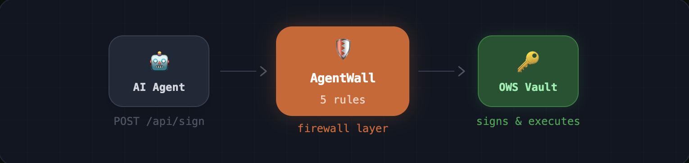
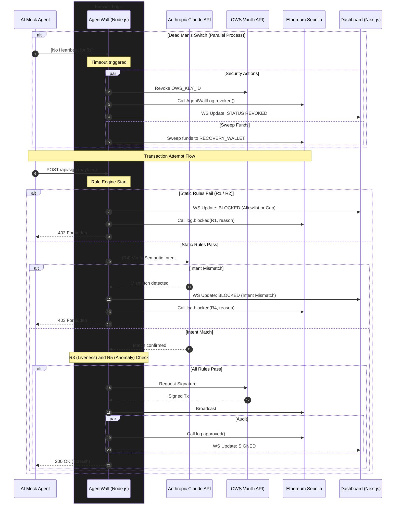

# AgentWall — Firewall on OpenWallet

Every transaction an AI agent tries to sign must pass through AgentWall first. Any rule fails the key never decrypts.

---

## Architecture


---

## Policies

| Rule | Name | What it checks |
|------|------|----------------|
| R1 | **Allowlist** | Recipient address must be on the agent's approved list |
| R2 | **Spend Cap** | Transaction must not exceed the agent's daily USDC limit |
| R3 | **Liveness** | Agent must have sent a heartbeat recently (Dead Man's Switch) |
| R4 | **Intent Verification** | Claude verifies the stated intent matches the actual transaction |
| R5 | **Anomaly Detection** | Flags amounts 5× above baseline or off-hours transfers to new addresses |

Each agent is configured independently in `agentwall.config.json`:

```json
{
  "agents": {
    "TradingAgent-01": { "spendCapUSDC": 500, "allowedChains": ["eip155:11155111"] },
    "SupportAgent-01": { "spendCapUSDC": 100, "heartbeatTimeoutMs": 5000 },
    "PayrollAgent-01": { "spendCapUSDC": 5000, "owsWallet": "payroll-wallet" }
  }
}
```

---

## Demo

▶ [Watch the demo](https://youtu.be/wrYmxwSPIMQ)

🐦 [X post](https://x.com/Jonumhills_/status/2040315599985754408?s=20)

🔗 [On-chain audit log — Ethereum Sepolia](https://sepolia.etherscan.io/address/0x26be9840C28B8b4FE5c4CdF7c0367B03dF6cB341#events)


---

## Sequence diagram



---

## Run locally

```bash
# 1. Start the firewall
npm run dev:firewall

# 2. Start the dashboard
npm run dev:dashboard

# 3. Run the 4-agent demo
npm run dev:agent:multi
```

Open [http://localhost:3000](http://localhost:3000) for the landing page and [http://localhost:3000/dashboard](http://localhost:3000/dashboard) for the live firewall dashboard.

---

*OWS Hackathon · Track 02 · Agent Spend Governance & Identity*


